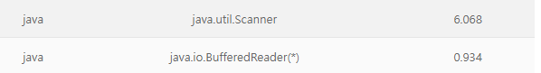

## 개요

> 아마 대다수 사람들이 BufferedReader 사용법을 백준 사이트에서 알고리즘 문제풀이를 시작으로 배우게 될 것이다.
> 나도 마찬가지로 Scanner 클래스를 사용했지만 시간초과가 나와서 해결법을 구글링한 결과로 처음 BufferedReader 클래스를 사용했다.
> 그 당시에는 이 둘의 차이점을 단지 BufferedReader 클래스가 더 빠르다고 인지만 한 상태로 넘겼지만,
> 이번 기회에 조금더 자세하게 알아보고 정리를 하려고 한다.

## Scanner

Scanner 클래스는 바이트 형식으로 입력 데이터를 받은 후 사용자가 정의한 타입으로 변환하여 전송하는 클래스이다.

<br>

## Scanner 클래스 특징

- 기본적인 데이터 타입들을 Scanner의 메소드를 사용하여 입력받을 수 있다.
  - String 같은 경우는 next(), nextLine()을 사용할 수 있으며, int로 받고 싶은 경우 nextInt()를 사용하여 입력받으면 해당 타입으로 입력된다.
- Scanner클래스는 util 패키지에 내부에 있기때문에 import해서 사용해야 한다.

```java
import java.util.*; // util 패키지 내부에 있는 클래스 모두 import
import java.util.Scanner; // util 패키지 내부에 있는 Scanner 클래스 import
```

- 공백(띄어쓰기) 및 개행(줄 바꿈)을 기준으로 읽는다.(' ', '\t', '\r', '\n' 등)
- 데이터를 입력받을 경우 즉시 사용자에게 전송되며 입력받을 때마다 전송되어야 하기에 많은 시간이 소요된다.
- 입력 데이터는 내부 로직에 인해 정규식을 검사한다.
- UnChecked(Runtime) Exception으로 별도로 예외 처리를 명시할 필요가 없다.

## BufferedReader

Buffer(버퍼)를 통해 입력받은 문자를 쌓아둔 뒤 한 번에 문자열처럼 프로그램에게 데이터를 전송하는 클래스이다.

<br>

## BufferedReader 클래스 특징

- 데이터를 파싱하지 않고 String으로만 읽고 가져온다.
  - readLine() 클래스로 문자열을 읽어온다.
  - 읽고 가져온 해당 문자열을 가공해서 사용

```java
BufferedReader br = new BufferedReader(new InputStreamReader(System.in));
int number = Integer.parseInt(br.readLine()) // int형으로 가공
```

- BufferedReader 클래스는 io 패키지에 내부에 있기때문에 import해서 사용해야 한다.

```java
import java.io.*; // io 패키지 내부에 있는 클래스 모두 import
import java.io.BufferedReader; // io 패키지 내부에 있는 BufferedReader 클래스 import

```

- Checked Exception으로 반드시 예외 처리를 명시해야한다.(I/O Exception을 throw하거나 try/catch 해야한다.)
  - 보통은 I/O Exception을 throw사용한다.
- **Scanner 클래스와 다르게 별다른 정규식을 검사하지 않는다.**
- **Buffer(버퍼)가 있는 스트림이다.**

> 위 둘의 특징으로 인해 Scanner보다 성능이 우수하다.

# Scanner와 BufferedReader의 차이점

**1.Scanner은 BufferedReader보다 타입에 구애받지 않는다.**

- Scanner는 위에 특징과 같이 여러가지 데이터 타입을 받을 수 있지만, BufferedReader같은 경우는 String 값 밖에 받지 못합니다.
  따라서 wrapper클래스의 도움을 받아 원하는 데이터로 변환을 해줘야 합니다.

**2. BufferedReader가 Scaner 보다 안전하다.**

- BufferedReader의 경우 동기화를 사용하지만 Scanner는 사용하지 않습니다.
- BufferedReader 같은 경우는 여러 쓰레드에서 안전하게 수행할 수 있습니다.
- Scanner는 안전하지 않으므로 외부에서 동기화를 해야합니다.

**2. BufferedReader가 Scanner보다 실행 속도가 빠르다.**

다음 그림은 10000000개의 정수를 입력받고 입력받은 정수의 합을 출력하는 코드에 대한 수행 시간 차이를 표입니다.


**3. BufferedReader는 직접적으로 예외처리를 해줘야한다.**

- BufferedReader는 I/O exception을 자체적으로 처리하지 못해서 throw 혹은 try ~ catch를 이용해야 한다.
- Scanner 같은 경우에는 I/O exception을 자체적으로 처리합니다.

**4. BufferedReader가 더 큰 Buffer Size를 가지고 있습니다.**

- Scanner(1024 chars)를 가지고 있으며, BufferedReader(8192 chars)가 더 큰 Buffer Size를 가지고 있습니다.

## 요약

|             | **BufferedReadr** |   **Scanner**    |
| :---------: | :---------------: | :--------------: |
| Buffer Size |       8192        |       1024       |
| 동기화 여부 |         O         |        X         |
| 문자열 파싱 | 단순히 읽어 들임  | 문자열 파싱 가능 |
|  Exception  | IOException 던짐  | IOException 숨김 |
