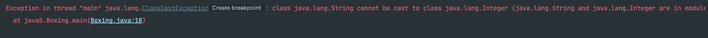
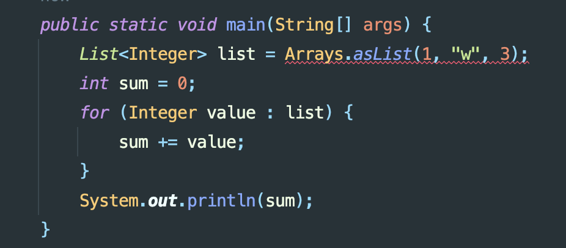
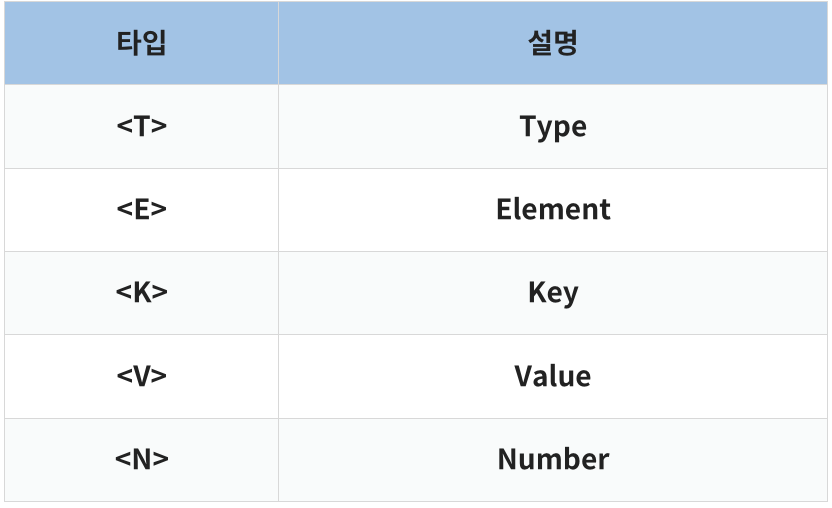

# JDK1.5 특징

> 2004년 9월에 출시, 이때 부터 버전 중 앞의 1을 빼고 표기하기 시작했다. (= Java 5)

# Contents

- Auto Boxing & Unboxing
- Generics
- Enum
- Varargs(Variable arguments)
- Enhanced For Loop
- Static Import

## Auto Boxing & Auto Unboxing

우리가 흔히 사용하는 자바 타입에는 두가기 종류가 있다.

Primitive(원시) & Reference(참조)

> Primitive -> int, long, folat, double, byte, short 등

Java는 모든 Primitive 타입에 대한 각각의 Wrapper Class를 제공

> Integer, Long, Float, Double, Byte, Short 등

다만, 이 Wapper Class는 참조 타입이기 때문에, 값이 아닌 값이 들어있는 객체의 주소를 가짐

```java
public static void main(String[] args) {
    // Boxing
    int a = 1;
    Integer b = new Integer(a);

    // Unboxing
    int c = b.intValue();
}
```

위와 같은 작업은 참조 타입과 원시 타입을 자주 변환해야 하는 경우 매우 귀찮은 상황이 발생한다.

JDK1.5 부터는 Auto Boxing과 & Auto Unboxing 을 통해 Boxing과 Unboxing을 기존처럼 명시적으로 래핑하거나 메소드를 호출하지 않고, 바로 할당할 수 있게 되었다.

다음 아래에 코드를 보면서 그 차이를 알아보자

## JDK1.5 이전

해당 아래 코드를 보면 getNumber() 메서드의 매개변수는 int 즉, 원시 타입을 가지고 있다.

main 메서드의 변수가 참조타입인 Integer라면 이를 unboxing을 통해 매개변수에 넣어줬어야 했다.

```java
public static void main(String[] args) {
    Integer b = new Integer(1);

    // Unboxing
    int a = getNumber(b.intValue());
}

private int getNumber(int a) {
    return a;
}

```

## JDK1.5 이후

해당 아래 코드를 보면 getNumber() 메서드의 매개변수는 int 즉, 원시 타입을 가지고 있다.

main 메서드의 변수가 참조타입인 Integer라면 이를 unboxing을 통해 매개변수에 넣어줬어야 했다.

```java
public static void main(String[] args) {
    Integer b = new Integer(1);

    // Auto Unboxing
    int a = getNumber(b);
}

private int getNumber(int a) {
    return a;
}

```

## 정리

Primitive 타입을 Wrapper 클래스로 변환하는 것을 **Auto Boxing**,
Wrapper 클래스를 Primitive 타입으로 변환하는 것을 **Auto Unboxing** 이라고 한다.

```java
public static void main(String[] args) {

    // Auto Boxing
    Integer b = 100;

    // Auto Unboxing
    int a = b;
}

```

## Generics

제네릭(Generic)은 데이터 형식에 의존하지 않고, **데이터의 타입 일반화** 한다는 것을 의미한다.

이로인해, 컬렉션 클래스와 같은 자료 구조에서 타입 안정성을 제공할 수 있게 되었다.

제네릭은 객체의 타입을 컴파일 시에 검사하여 타입 안정성을 보장하며, 컴파일 에러를 감지할 수 있게 되었다.

## JDK1.5 이전

List에 포함된 요소를 모두 더하는 로직이다.

List에 타입 지정을 안 했기 때문에 Object로 타입이 지정되고 더하는 부분에서 형변환을 직접 해줘야 한다.

```java
public static void main(String[] args) {
    List list = Arrays.asList(1, "w", 3);
    int sum = 0;
    for (Object value : list) {
        sum += (int) value;
    }
    System.out.println(sum);
}
```

값을 잘못 넣어 int형이 아닌 String형의 값을 넣었다면 컴파일 에러가 발생하지 않고

런타임에서 **ClassCastException** 에러가 발생한다.



## JDK1.5 이후

```java
public static void main(String[] args) {
    List<Integer> list = Arrays.asList(1, "w", 3);
    int sum = 0;
    for (Integer value : list) {
        sum += value;
    }
    System.out.println(sum);
}
```

제네릭을 사용하면 불필요한 형변환을 안해도 되는 이점과

아래와 같이 컴파일 시점에러 에러를 확일 할 수 있기 때문에 타입에 대한 안전성을 높일 수 있다.



우리가 사용 자료구조를 만들 때 String 타입과 Integer 타입을 상황마다 사용하고 싶다고 가정을 해본다면,

이 두개의 타입을 지원하는 자료구조를 둘다 만들어야하는 상황이 온다.

이러한 불필요한 상황과 문제를 해결하기 위해 우리는 제네릭의 이점을 활용할 수 있다.

## 정리

다음 아래 코드와 같이 String 타입, Integer 타입을 가지는 Box 클래스를 만들고 싶을 때 제네릭을 사용하여

코드의 유연성을 더해 간단하게 명시할 수 있다.

여기에서 T는 Type 을 의미한다. 제네릭의 사용 방법은 아래와 같다.



```java
public class Main {

    static class Box<T> {
        T data;

        public Box(T data) {
            this.data = data;
        }
        public T getData() {
            return data;
        }
    }

    public static void main(String[] args) {
        Box<Integer> integerBox = new Box<>(1);
        Box<String> strBox = new Box<>("junxtar");

        System.out.println("integerBox.getData() = " + integerBox.getData());
        System.out.println("strBox.data = " + strBox.data);
    }
}
```

## Enum

Enum(열거형)은 서로 연관된 상수들을 그룹화하여 정의하는 특별한 Class이다.

```java
enum Color {
    RED, GREEN, BLUE;
}

public class Enum {

    public static void main(String[] args) {
        // 열거형 상수 사용
        Color red = Color.RED;

        // 열거형 상수 비교
        if (red == Color.RED) {
            System.out.println("It's a red!");
        } else {
            System.out.println("It's not red.");
        }

        // 열거형 상수 순회
        System.out.println("color:");
        for (Color color : Color.values()) {
            System.out.println(color);
        }
    }
}

```

## Varargs(Variable arguments)

variable arguments 의 줄임말로, 메서드의 인자로 받을 value 갯수를 임의로 설정하는 방식이다.

## JDK1.5 이전

매개변수가 다를 경우 오버로딩을 활용해서 메서드를 정의할 수 있습니다.

하지만 아래와 같은 코드 같은 경우는 **같은 인자** 에 대해서 반복적인 행위를 하는 오버로딩입니다.

```java
public class Calculator {
    public int sum(int a, int b) {
        return a + b;
    }

    public int sum(int a, int b, int c) {
        return a + b + c;
    }
}
```

## JDK1.5 이후

아래 와 같이 [타입] + [...] + [변수이름] 으로 메서드 선언으로 코드를 통일할 수 있다.

이전 1.5 버전 이전에는 만약에 1개 ~ 10개 까지의 더하는 메서드가 필요한 경우 이를 10개 만들어줘야 하는

불편함이 있지만 아래와 같이 선언함으로서 불필요한 행위를 줄일 수 있다.

```java
public class Calculator {
    public int sum(int...args) {
        int result = 0;
        for (int arg : args) {
            result += arg;
        }
        return result;
    }
}
```

## Enhanced For Loop (향상된 반복문)

해당 향상된 반복문은 평소에도 자주 사용한다.

사용하는 이점으로는 간편 + 가독성이라고 생각한다.

또한, 기존 반복문을 통해서 순회 하면 ArrayIndexOutBoundsException 을 발생할 수 있는데 이를 방지 할 수 있다.

## JDK1.5 이전

아래와 같이 순회 해서 사용할 수 있다.

하지만 i 범위를 직접 선언하기 때문에 배열의 범위를 벗어난다면 위에서 설명했든이 런타임 시점에서 에러가 발생한다.

```java

public class Loop {

    public static void main(String[] args) {
        int[] arr = Arrays.asList(1, 2, 3);

        for (int i = 0; i < arr.length; i++) {
            System.out.println(arr[i]);
        }
    }
}
```

## JDK1.5 이후

가독성 측면에서 위와 비교하면 좋다는 것을 확인할 수 있으며,

내부적으로 동작하기 때문에 배열의 범위를 벗어날 걱정을 하지 않아도 된다.

```java

public class Loop {

    public static void main(String[] args) {
        int[] arr = Arrays.asList(1, 2, 3);

        for (int element : arr) {
            System.out.println(element);
        }
    }
}
```

## Static Import

static import문을 사용하면 static멤버를 호출할 때 클래스명을 생략 할 수 있다.

또한 코드가 간결해지는 이점이 있다.

## JDK1.5 이전

```java

public class Loop {

    public static void main(String[] args) {
        System.out.println(Math.random());
        System.out.println(Integer.MAX_VALUE);
    }
}
```

## JDK1.5 이후

```java
import static java.lang.Math.random;
import static java.lang.Integer.MAX_VALUE;

public class Loop {

    public static void main(String[] args) {
        System.out.println(random());
        System.out.println(MAX_VALUE);
    }
}
```

하지만 주의해야할 점이 있다.

클래스 내에 동일한 이름의 메소드가 있으면 클래스 자신의 메소드가 우선한다.

마치 현재 클래스의 멤버인 것처럼 사용할 수 있기 때문에 편리하지만 그만큼 **혼동을 주기 쉽다**.
