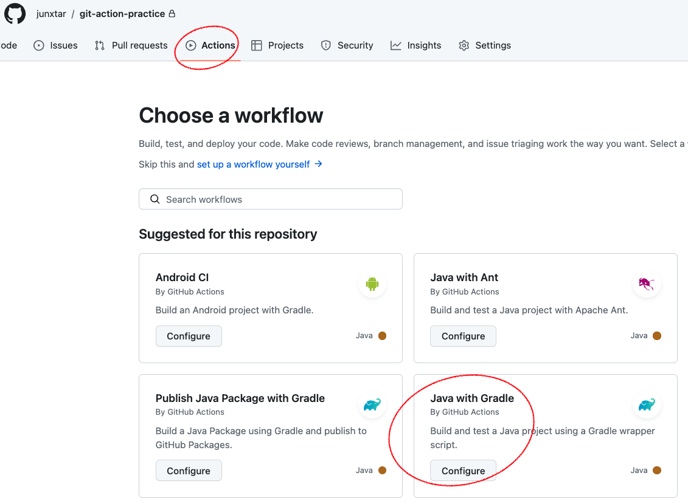
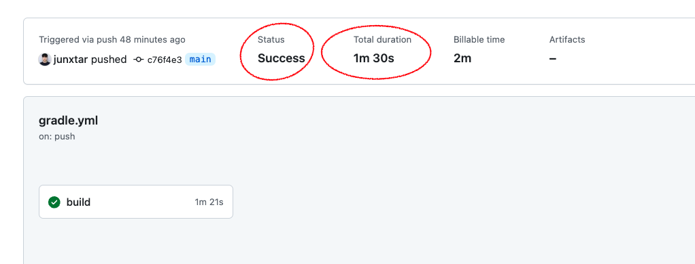
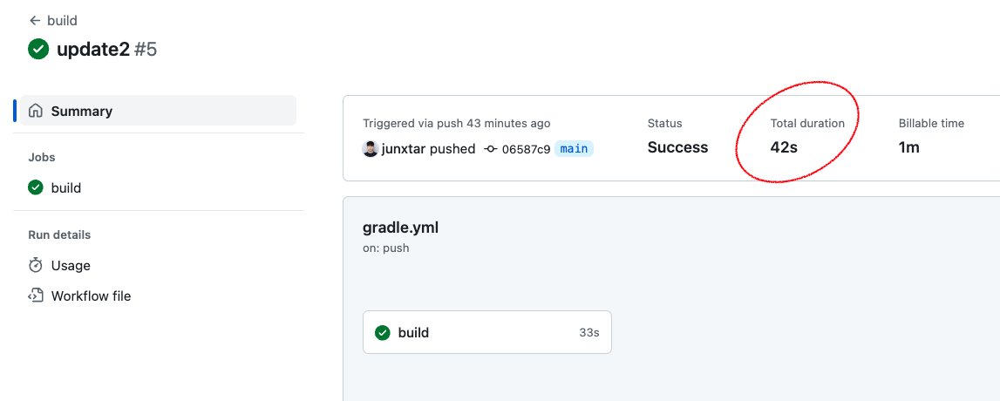

# 개요

> 최종 프로젝트를 앞두고 여러 개발자가 동시에 하나의 프로젝트에 참여하는 경우 충돌을 방지하기 위해서 CI / CD를
> 적용해보려고 한다.

## Github Action 구성

Github Action의 repository를 하나 만든 후에 action tab에 들어가 기본 구성을 gradle로 선택해주었다.



그러고 난 후 기본 설정에 java의 버전을 나의 현재 프로젝트 버전에 맞추어 준후 실시를 하였다.

밑에는 설정 코드이다.

push 혹은 pull_request를 할 때 빌드를 돌려서 실패하면 push를 하지 못하는 설정이다.

```java
name: build

on:
  push:
    branches:
      - main
  pull_request:
    branches:
      - main

permissions:
  contents: read

jobs:
  build:
    runs-on: ubuntu-latest
    steps:
    - uses: actions/checkout@v3
    - name: Set up JDK 17
      uses: actions/setup-java@v3
      with:
        java-version: '17'
        distribution: 'corretto'
    - name: Add permission
      run: chmod +x gradlew
    - name: Build with Gradle
      uses: gradle/gradle-build-action@bd5760595778326ba7f1441bcf7e88b49de61a25 # v2.6.0
      with:
        arguments: build
```

## 결과



하지만 생각보다 시간이 너무 오래 걸렸다....

build하는데 1분 30초가량은 너무 오래 걸린다고 생각되어서 이를 개선하는 방법을 찾아보았다.

구글링으로 찾아보니 Github Actions에서 Gradle 캐싱처리를 할 수 있는 방법을 찾아서 바로 도입을 해보았다.

위 코드에서 캐싱에 대한 코드를 추가하였다.

```java
name: build

on:
  push:
    branches:
      - main
  pull_request:
    branches:
      - main

permissions:
  contents: read

jobs:
  build:
    runs-on: ubuntu-latest
    steps:
    - uses: actions/checkout@v3
    - name: Set up JDK 17
      uses: actions/setup-java@v3
      with:
        java-version: '17'
        distribution: 'corretto'
    - name: Add permission
      run: chmod +x gradlew
    - name: Build with Gradle
      uses: gradle/gradle-build-action@bd5760595778326ba7f1441bcf7e88b49de61a25 # v2.6.0
      with:
        arguments: build

    - name: Build with Gradle
      run: ./gradlew build
      shell: bash
```

# 결과

다음 그림과 같이 약 절반의 가량이 단축되는 것을 알 수 있었다.



## 마무리

사실 여기서 평소에 build를 intellij에서 직접 해주었을 때 clean도 같이 해주는 습관이 있어서 관련된 자료를

찾아보니 있어서 clean 또한 추가를 해주었다.

stracktrace는 build 실패시 어디에서 오류 문구가 났는지 더 자세하게 볼 수 있는 설정이다.

```java
- name: Build with Gradle
      run: ./gradlew clean build --stacktrace
      shell: bash
```
