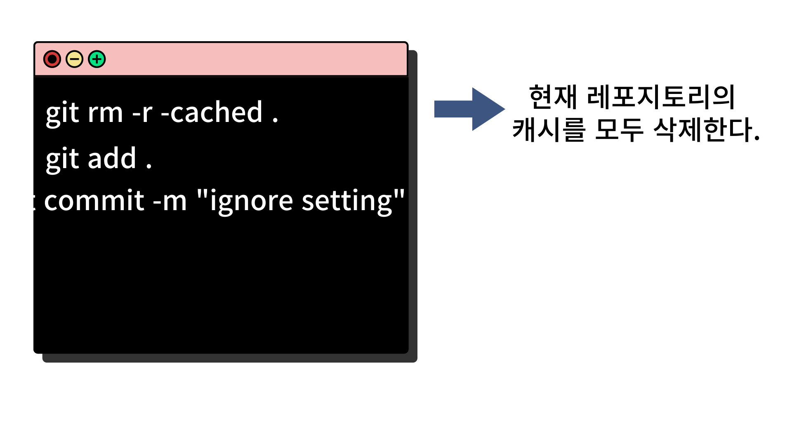

## 개요

> .idea파일을 git 관리 대상에서 제외하기 위해서 gitignore을 작성을 했지만 문제를 마주했다.

### .gitignore이란??

- .gitignore파일이란 Git 버전 관리에서 제외할 파일 목록을 지정하는 파일이다.
- 파일 혹은 폴더 목록을 지정하여 작성하면, 특정 목록들은 git의 관리대상에서 제외된다.

### 문제점

`gitignore 파일을 올바르게 작성을 했지만 해당 내용이 적용이 되지 않았다.`

**.gitignore 파일은 아래와 같이 작성을 했다.**

 

**이미 원격저장소에는 파일이 존재해서 gitignore 파일이 올바르게 적용이 되지 않았다.**

 

### 해결방법

**아래와 같이 터미널에 입력을 해주면 올바르게 적용되는 것을 확인할 수 있다.**

