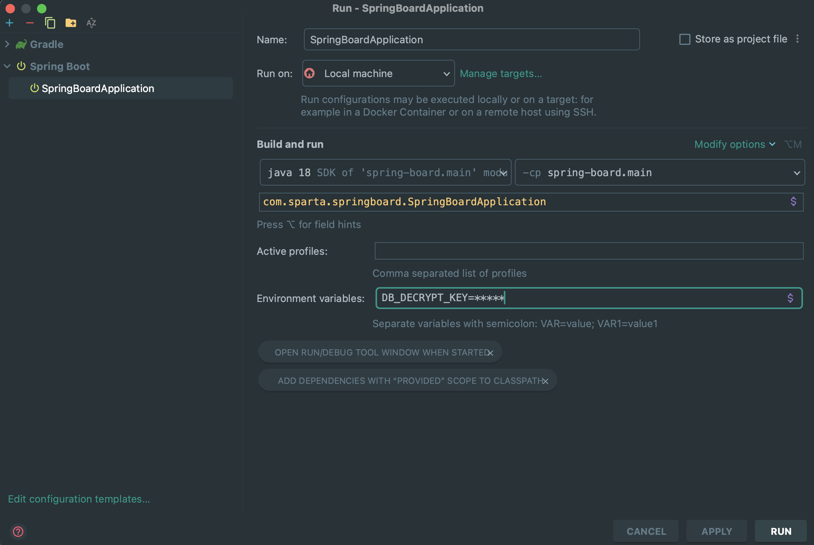

# 개요

> 익명 게시판 프로젝트를 진행하면서 서버와 Mysql을 연결헤주기 위해서 application.properties 파일에 DB 정보를 입력해주었다.
> 하지만 비밀번호 같은 경우와 DataSource url 같이 중요한 정보를 외부에 노출하는게 올바르지 않다고 생각해 찾아본 결과 jasypt 라이브러리였다.

## jasypt란

간단히 말하면 Java, Spring 등에서 암복호화를 지원해주는 오픈소스라고 할 수 있다.

개발자 입장에서는 최소한의 코드로 암호화 및 복호화를 사용할 수 있는 것이다!

## jasypt 적용 전

```java
## database
spring.datasource.driver-class-name=com.mysql.cj.jdbc.Driver
spring.datasource.url= jdbc:mysql://localhost:3306/{database-name}
spring.datasource.username={user-name}
spring.datasource.password={password}
```

위 상황이 만약 실제 RDS 혹은 사용자의 비밀번호라면? Commit 시 외부에 공개가 되는 상황이 발생하게 된다.

## jasypt 적용 단계

#### 1. build.gradle -> Dependency 작성

```java
 //jasypt
    implementation 'com.github.ulisesbocchio:jasypt-spring-boot-starter:3.0.5'
```

#### 2. JasyptConfig Class 작성

나는 config 파일을 만들어 작성하였다.

아래 코드에서 PASSWORD 같은경우는 3번에서 다루겠습니다.

```java
@Configuration
@EnableConfigurationProperties
public class JasyptConfig {

    private static final String PASSWORD = "DB_DECRYPT_KEY";
    private static final String ALGORITHM = "PBEWithMD5AndDES";
    private static final String KEY_OBJECTION_ITERATIONS = "1000";
    private static final String POOL_SIZE = "1";
    private static final String PROVIDER_NAME = "SunJCE";
    private static final String SALT_GENERATOR_CLASS_NAME = "org.jasypt.salt.RandomSaltGenerator";
    private static final String STRING_OUTPUT_TYPE = "base64";

    @Bean("jasyptStringEncryptor")
    StringEncryptor stringEncryptor() {
        PooledPBEStringEncryptor encryptor = new PooledPBEStringEncryptor();
        SimpleStringPBEConfig config = new SimpleStringPBEConfig();
        config.setPassword(System.getenv(PASSWORD));
        config.setAlgorithm(ALGORITHM);
        config.setKeyObtentionIterations(KEY_OBJECTION_ITERATIONS);
        config.setPoolSize(POOL_SIZE);
        config.setProviderName(PROVIDER_NAME);
        config.setSaltGeneratorClassName(SALT_GENERATOR_CLASS_NAME);
        config.setStringOutputType(STRING_OUTPUT_TYPE);
        encryptor.setConfig(config);
        return encryptor;
    }
}

```

#### 3. password 환경변수 설정

아래 사진과 같이 환경변수에 변수를 선언해 value 값을 넣어주었다.

Intellij -> run -> editconfigration 설정으로 아래 이미지처럼 설정을 해줄 수 있다.



#### 4. jasypt test

아래 코드와 같이 test환경에서 DB 설정 값들을 추출해보면서 application.properties를 설정해주었다.

**사이트**에서 암호화된 값을 추출할 수 있지만 중요 데이터를 요청 값으로 넘기는 행위보다는 직접 추출해내는 행위가 맞다고 생각했다.

- [암호화 사이트](https://www.devglan.com/online-tools/jasypt-online-encryption-decryption)

```java
public class JasyptConfigTest {

    @Test
    void stringEncryptor() {
        // given
        StandardPBEStringEncryptor encryptor = new StandardPBEStringEncryptor();
        encryptor.setPassword(" ");
        String test = "test";

        // when, then
        String actual = encryptor.encrypt(test);
        Assertions.assertEquals(test, encryptor.decrypt(actual));
    }
}
```

## jasypt 적용 후

```java
## database
spring.datasource.driver-class-name=com.mysql.cj.jdbc.Driver
spring.datasource.url=ENC(Qyaoq27AtJOkcGqN/tnHwro0gknuLc4sCbZ9IsMdwuqXFFZy6nPHKoVQPiUE7jDi)
spring.datasource.username=ENC(QfNYfx3DTFDJXyrD/jifxQ==)
spring.datasource.password=ENC(R9HKRfIDpoC53p2x369RzKF9k4+TnS0i)
```

## 마무리

> 새로운 라이브러리를 찾아보고 이를 접목해보는 것은 내 얕은 지식의 조금 더 보탬이 되는 행위라고 생각을 한다.
> 앞으로도 새로운 것을 코드에 적용할 때 겁먹기 보다는 일단 한번 삽질하면서 부딪혀보는 자세를 가져 임해야겠다.
