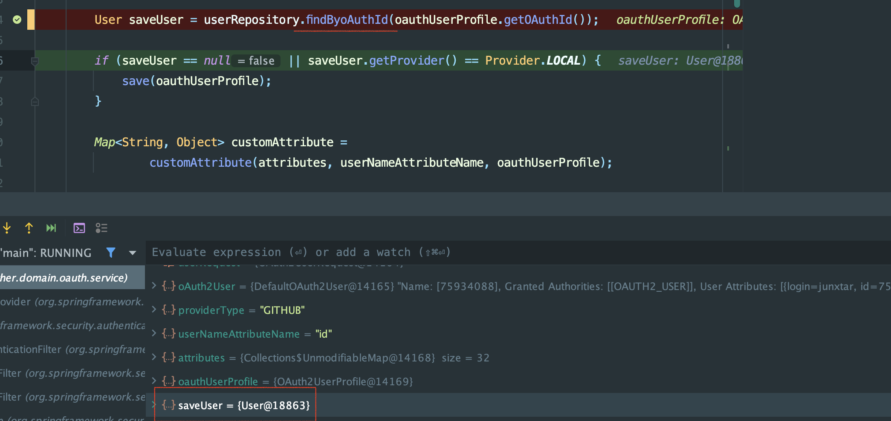
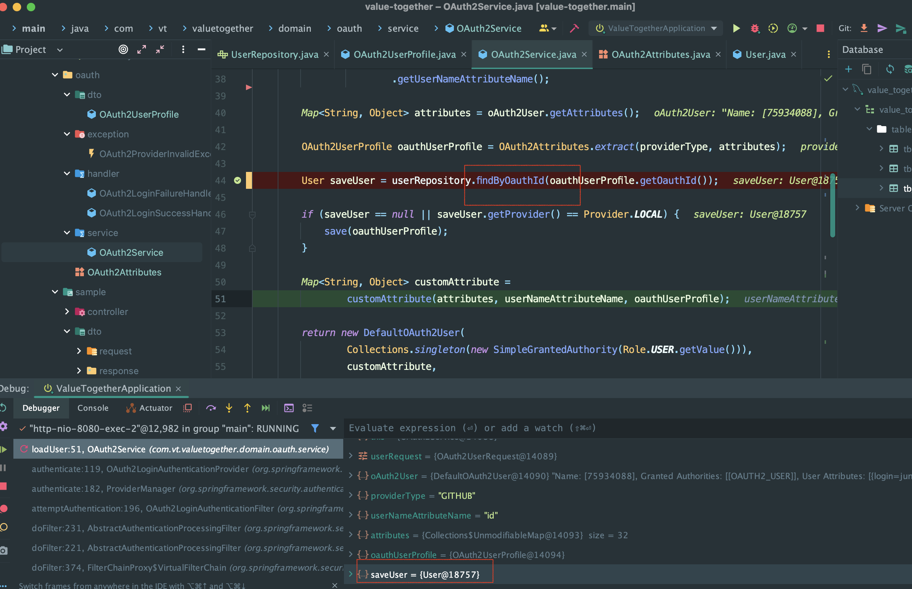

## 개요

> 프로젝트를 진행하면서 소셜로그인 기능을 구현하였다.
> 소셜로그인을 진행하면서 고유한 필드값이 필요했기에 oAuthId라는 필드 값을 가지고 갔을 때 발생한 문제를 다룰예정이다.

## User Entity

```java
@Entity
@Getter
@NoArgsConstructor
@Table(name = "tb_user")
public class User extends BaseEntity {

    @Id
    @GeneratedValue(strategy = GenerationType.IDENTITY)
    private Long userId;

    private String username;

    private String password;

    private String email;

    private String profileImageUrl;

    private String oAuthId;     // 개요에서 언급한 필드

    @Enumerated(value = EnumType.STRING)
    private Role role;

    @Enumerated(value = EnumType.STRING)
    private Provider provider;

    @Builder
    private User(
            Long userId,
            String username,
            String password,
            String email,
            String profileImageUrl,
            String oAuthId,
            Role role,
            Provider provider) {

        this.userId = userId;
        this.username = username;
        this.password = password;
        this.email = email;
        this.profileImageUrl = profileImageUrl;
        this.oAuthId = oAuthId;
        this.role = role;
        this.provider = provider;
    }
}
```

## User Repository

우리 팀은 @RepositoryDefinitaion을 사용하여 사용할 메서드만 정의를 하였다.
메서드를 무작위로 열어놓기보다는 우리가 사용할 메서드만 알맞게 프로젝트에 가져가고 싶은 생각에 컨벤션에 정의하고 프로젝트를 진행하였다.

```java
@RepositoryDefinition(domainClass = User.class, idClass = Long.class)
public interface UserRepository {
    User findByOAuthId(String OAuthId);
}

```

## 에러

해당 아래 부분에서 findByOAuthId에서 에러가 발생한 것을 확인을 할 수 있다.

```java
Caused by: java.lang.IllegalArgumentException: Failed to create query for method public abstract com.vt.valuetogether.domain.user.entity.User com.vt.valuetogether.domain.user.repository.UserRepository.findByOAuthId(java.lang.String); Unable to locate Attribute with the given name [OAuthId] on this ManagedType [com.vt.valuetogether.domain.user.entity.User]
	at org.springframework.data.jpa.repository.query.PartTreeJpaQuery.<init>(PartTreeJpaQuery.java:107) ~[spring-data-jpa-3.2.0.jar:3.2.0]
	at org.springframework.data.jpa.repository.query.JpaQueryLookupStrategy$CreateQueryLookupStrategy.resolveQuery(JpaQueryLookupStrategy.java:124) ~[spring-data-jpa-3.2.0.jar:3.2.0]
	at org.springframework.data.jpa.repository.query.JpaQueryLookupStrategy$CreateIfNotFoundQueryLookupStrategy.resolveQuery(JpaQueryLookupStrategy.java:258) ~[spring-data-jpa-3.2.0.jar:3.2.0]
	at org.springframework.data.jpa.repository.query.JpaQueryLookupStrategy$AbstractQueryLookupStrategy.resolveQuery(JpaQueryLookupStrategy.java:95) ~[spring-data-jpa-3.2.0.jar:3.2.0]
	at org.springframework.data.repository.core.support.QueryExecutorMethodInterceptor.lookupQuery(QueryExecutorMethodInterceptor.java:111) ~[spring-data-commons-3.2.0.jar:3.2.0]
	... 119 common frames omitted
```

## 문제점의 이유를 파보자!

엔티티가 DDL을 이용하여 테이블을 생성할 때에 따로 설정하지 않은 상태라면 필드명을 통해 컬럼명을 정하게 된다.

처음에 맞이하는 대문자들은 소문자로 바꾸고 이후에 맞이하는 대문자들은 언더바를 사용해 표시한다.

```java
private String oauthId -> oauth_id로 생성
private String Oauthid -> oauthid로 생성
private String OauthId -> oauth_id로 생성
private String OAuthId -> oauth_id로 생성
private String oAuthId -> o_auth_id로 생성
```

보통 필드명은 CamelCase를 사용하니 `oAuthId`와 같이 사용하게 될 것이다.

그렇다면 내가 필드로 설정한 String oAuthId는 어떤 값으로 변할까?

바로 `o_auth_id`로 변환이 된다.

이렇게 변환되는 부분까지는 문제가 없으며,

문제는 바로 메서드 이름으로 쿼리를 생성하는 JPA 쿼리메서드를 사용할 때 발생한다.

`findByOAuthId` 해당 메서드의 쿼리가 어떤식으로 읽히는지 살펴보겠다.

find -> select where 문으로 OAuthId로 조건으로 설정해 두었다.

보통 `findByName`에서 `String name`필드를 `Name`이라고 표현한 것을 보아

조건을 입력할 때 보통 앞글자를 대문자로 둔다는 것을 확인할 수 있다.

그렇다면 쿼리의 조건이 oauth_id = ? 로 나가게 될 것이다.

여기서 문제점을 확인할 수 있었다.

우리가 User에서 필드로 oAuthId는 DB 컬럼명으로 `o_auth_id`로 가지고 있는데,

조건에서는 `oauth_id`로 이 값을 찾고 있던 것이며, 이를 JPA에서 찾지 못한 것이다.

#### 해결법

아래 코드와 같이 바꾼다면 해결이 되나? (정말 노파심에 테스트 해본 것이다.)

싶은 생각에 디버깅을 해본 결과 그림 처럼 되는 것을 확인할 수 있다.

```java
@RepositoryDefinition(domainClass = User.class, idClass = Long.class)
public interface UserRepository {
    User findByoAuthId(String oAuthId);
}

```



또다른 방법은 필드명 변경이다.

기존에 `oAuthId`의 값은 `oauthId`로 변경을 하는 것이다.

이 방법은 일반적으로 변수명을 카멜케이스로 쓰기 때문에 상당한 혼동을 줄 수 있다고 생각한다.

```java
@Entity
@Getter
@NoArgsConstructor
@Table(name = "tb_user")
public class User extends BaseEntity {

    @Id
    @GeneratedValue(strategy = GenerationType.IDENTITY)
    private Long userId;

    private String username;

    private String password;

    private String email;

    private String profileImageUrl;

    private String oauthId;      // oAuthId -> oauthId로 변경

    @Enumerated(value = EnumType.STRING)
    private Role role;

    @Enumerated(value = EnumType.STRING)
    private Provider provider;

    @Builder
    private User(
            Long userId,
            String username,
            String password,
            String email,
            String profileImageUrl,
            String oauthId,
            Role role,
            Provider provider) {
        this.userId = userId;
        this.username = username;
        this.password = password;
        this.email = email;
        this.profileImageUrl = profileImageUrl;
        this.oauthId = oauthId;
        this.role = role;
        this.provider = provider;
    }
}
```

```java
@RepositoryDefinition(domainClass = User.class, idClass = Long.class)
public interface UserRepository {
    User findByOauthId(String oauthId);
}

```



이렇게 두가지 해결방법을 찾아봤는데

둘 중 무엇을 선택할지 팀원들과 상의가 필요한 부분 인것 같다.

이번 문제로 앞으로 필드의 네이밍을 지을 때 한번더 고려해볼 것 같다.

지양해야 하는 필드명(컬럼명)
case 1) 첫번째 소문자, 두번째 대문자 : aBCDNo(Field) -> getABCDNo(롬복) -> abcdno(Jackson)
case 2) 첫번째 대문자, 두번째 대문자 : BBbb(Field) -> getBBbb(롬복) -> bbbb(Jackson)
