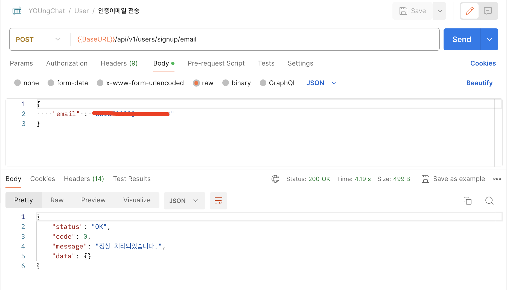
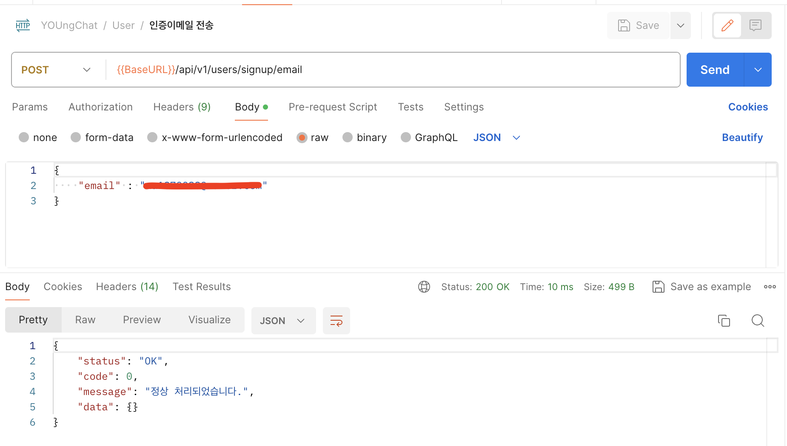

## 개요

> YOUngChat 프로젝트를 진행할 당시 메일의 응답시간에 대해서 너무 느리다고 판단을 하였다.

> 메일의 응답 처리를 개선하기 위해서 검색을 하면서 비동기 처리에 대해서 알게되었고 이를 적용해보는 시간을 가지려고 한다.

### 기존 비동기 처리 전 메일 응답 시간

약 4초의 시간이 소요되는 것을 확인할 수 있다.

사용자가 응답을 위해 4초를 기다리기 보다는, 검증을 마치고 응답을 보낸 후 이메일 전송은 비동기로 진행하는 것이 더 나은 사용자 경험이라 판단했다.



### @Async를 활용한 비동기 처리

#### @EnableAsync 어노테이션으로 Spring에게 우리가 @Async 어노테이션을 활용할 것임을 알린다.

1. 비동기로 동작하기 바라는 메서드에 @Async 어노테이션을 붙인다.

2. 아래와 같이 메서드에 @Async를 붙임으로써 개발자는 핵심 기능에만 집중할 수 있다.

```java
 @Async
    public void sendMessage(String to, String subject) {
        try {
            String code = createAuthCode();
            MimeMessage message = createMessage(to, subject, code);

            if (emailAuthService.hasMail(to)) {
                emailAuthService.delete(to);
            }
            EmailAuth emailAuth = EmailAuth.builder()
                .email(to)
                .code(code)
                .build();

            emailAuthService.save(emailAuth);
            javaMailSender.send(message);
        } catch (MessagingException e) {
            throw new GlobalException(ResultCode.EMAIL_SEND_FAIL);
        }
    }
```

### @Async의 원리

@Async는 기본적으로 스프링 AOP에 의해 프록시 패턴 기반으로 동작한다.

1. @Async 어노테이션이 붙은 메서드가 호출되면, 스프링은 해당 호출을 가로채서 비동기 실행을 처리하기 위한 프록시 객체를 생성한다.

2. 해당 메서드는 TaskExecutor에 의해 스레드풀에 작업으로 등록한다.

3. 해당 메서드는 호출자와 별도의 스레드에서 작업이 진행되며, 호출자 메서드는 블러킹되지 않고 즉시 리턴된다.

@Async가 올바르게 동작하기 위해서 `두 가지 조건`

- public 메서드에서만 적용 가능하다.
- self-invocation은 불가하다. (같은 클래스의 메서드를 호출할 수 없다.)

### @Bean을 활용한 EnableAsync 적용

@Bean을 사용해 TaskExecutor를 직접 빈으로 등록하여 사용할 수 있다.

이 때, 다수의 Bean을 등록해서 활용할 수 있다.

```java
@Configuration
@EnableAsync
@Slf4j
public class AsyncConfig implements AsyncConfigurer {

    @Override
    @Bean(name = "mailExecutor")
    public Executor getAsyncExecutor() {
        ThreadPoolTaskExecutor executor = new ThreadPoolTaskExecutor();
        executor.setCorePoolSize(2);
        executor.setMaxPoolSize(5);
        executor.setQueueCapacity(10);
        executor.setThreadNamePrefix("Async MailExecutor-");
        executor.setRejectedExecutionHandler((r, exec) -> {
            throw new IllegalArgumentException("더 이상 요청을 처리할 수 없습니다.");
        });
        executor.initialize();
        return executor;
    }
```

### ThreadPoolTaskExecutor의 주요 옵션들

- corePoolSize
  - 스레드 풀에 항상 살아있는 최소 스레드 수
  - 예상 최대 동시 작업 수에 가까운 값으로 설정하는 것이 좋다.
- maxPoolSize
  - 스레드 풀이 확장할 수 있는 최대 스레드 수
  - [queueCapacity + corePoolSize]가 넘는 요청이 들어온 경우, 스레드풀이 얼만큼 확장할 수 있는지.
- queueCapacity
  - 스레드 풀에서 사용할 최대 큐의 크기
- threadNamePrefix
  - 생성된 각 스레드의 이름 접두사
- rejectedExecutionHandler
  - maxPoolSize 크기가 초과 되었을 경우 전략 (default: `AbortPolicy`)
    - AbortPolicy: TaskRejectedException을 발생시키며 종료한다.

### 비동기 처리 결과

비동기를 처리한 10ms 시간이 소요된 것을 확인할 수 있다.

약 4초 -> 0.01초로 단축한 것을 확인할 수 있었다.



### 마무리

기존에는 ThreadPoolTaskExecutor의 설정을 별 고민 없이 설정했는데,

API 스펙과 서버 스펙 등을 따져보고 신중하게 결정해야한다는 것을 알았다.

무조건 corePoolSize 크게 설정하는 것이 장점만 존재하는 것이 아니다.

`자원의 낭비` 의 대표적인 예시가 될 수 있다고 생각을 한다.

이런 trade-off 관계에 있어서 우리의 서비스가 어느정도의 스펙인지 항상 인지하고 접목하는 것이 가장 중요한 것 같다.

사실 아직은 적절한 값을 산정하는 방법은 잘 모르겠다.

조금 더 성장한 내가 이 글을 보고 산정 방법을 알았으면 하는 바램이다.
