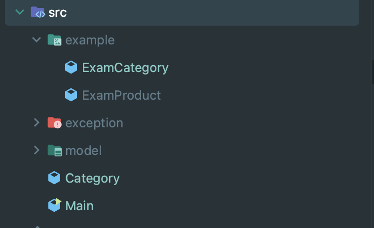
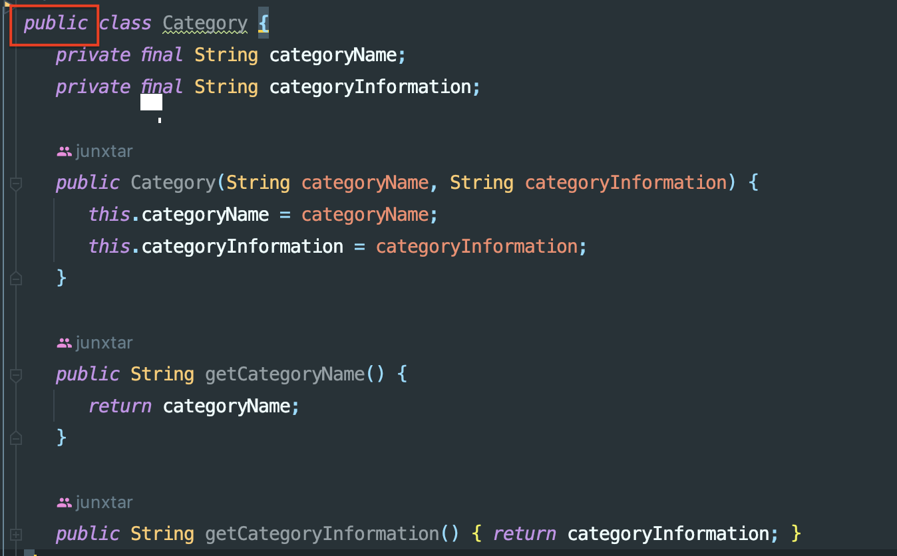
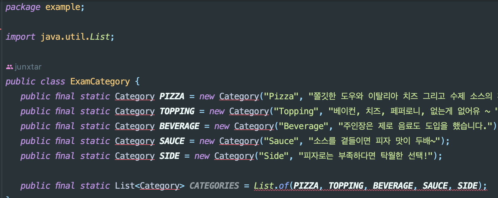
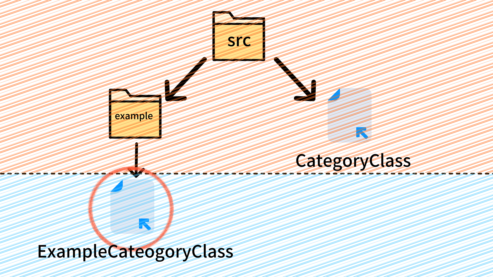
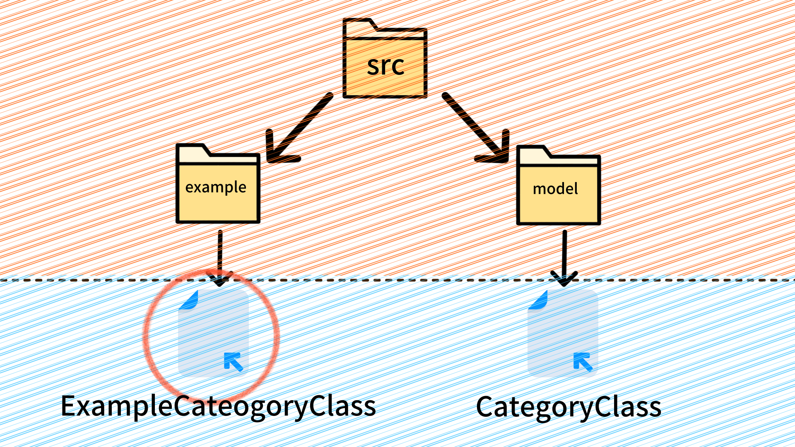
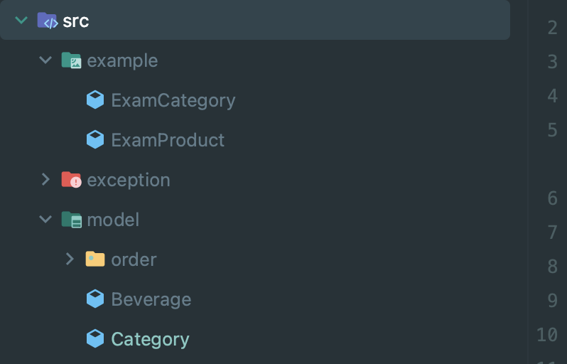
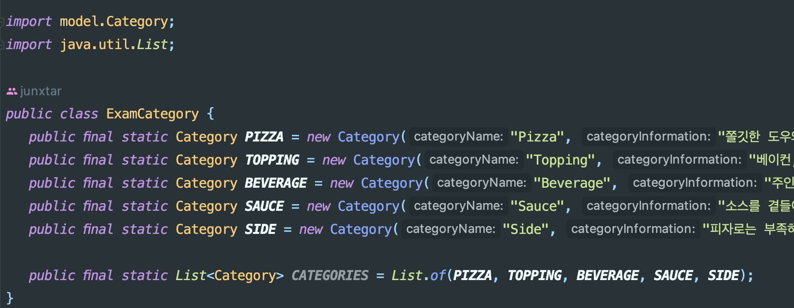

## 개요

> public 접근 제어자를 사용하면 해당 클래스 변수를 다른 클래스에서도 사용할 수 있다는 것을 인지한채 해당 문제를 마주쳤다.

### 접근 제어자

- [접근 제어자 설명](https://github.com/junxtar/TIL/blob/main/Java/accessModifier.md)

### 문제점

`public 으로 설정된 Catrgory Class를 ExampleCategory Class가 인식을 하지 못하는 문제`

### 파일 구조

아래 사진과 같이 현재 Cateogy는 src폴더 하위에 있는 파일이며 ExampleCategory같은 경우 example 폴더 하위에 있다.

### Category

Category 클래스는 접근 제어자로 public으로 설정

### ExampleCategory

ExampleCategory 클래스 현재 Cateogy 클래스를 인식을 못한다.

### 문제 해결 방법

폴더와 파일의 계층간의 인식 문제였다.
`아래 그림을 보자!`
아래 그림은 ExampleCategory의 시점에서의 그림이다. 자신보다 상위 계층에 있는 Category를 찾지 못하는 모습을 보인다.

나는 계층을 맞춰주기 위해서 Category를 model이라는 패키지를 만들어 계층을 낮춰줬다.

#### 수정한 폴더 구조

 

아래 그림처럼 인식을 하여 정상적으로 import하였다.

