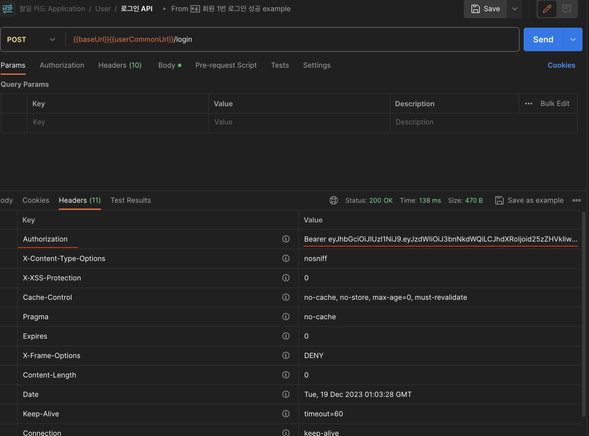
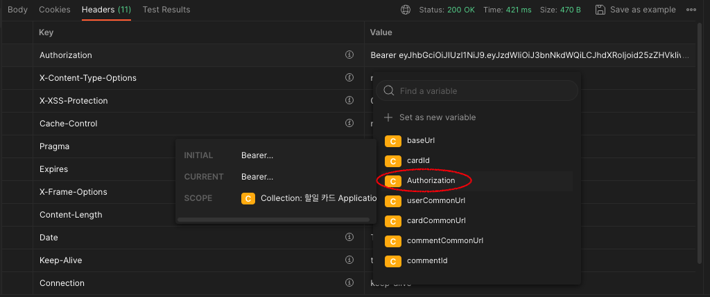
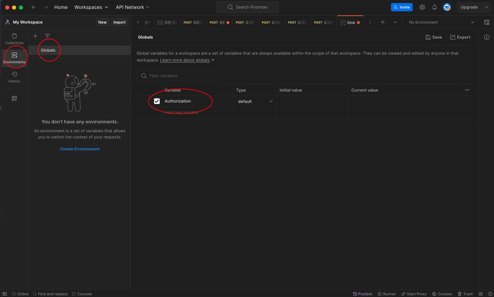
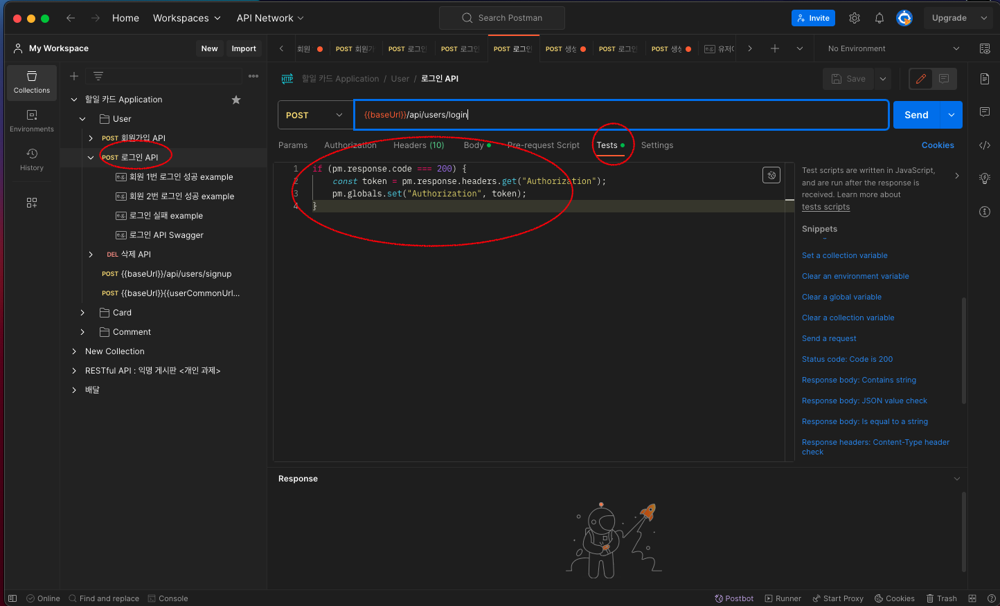
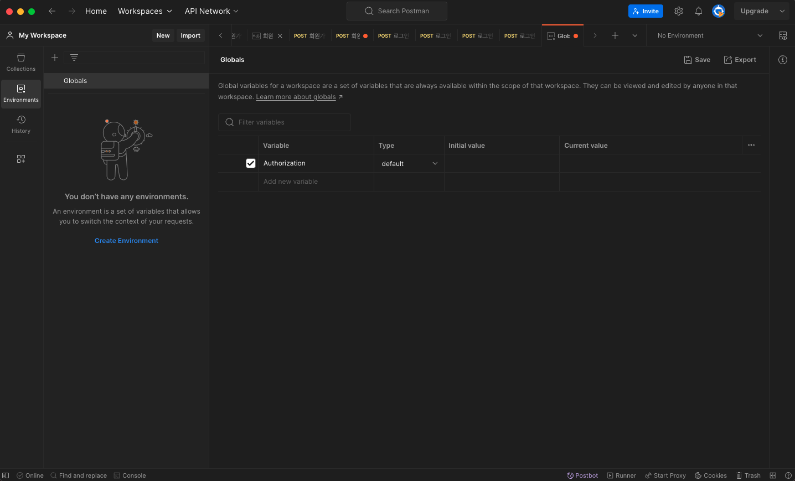
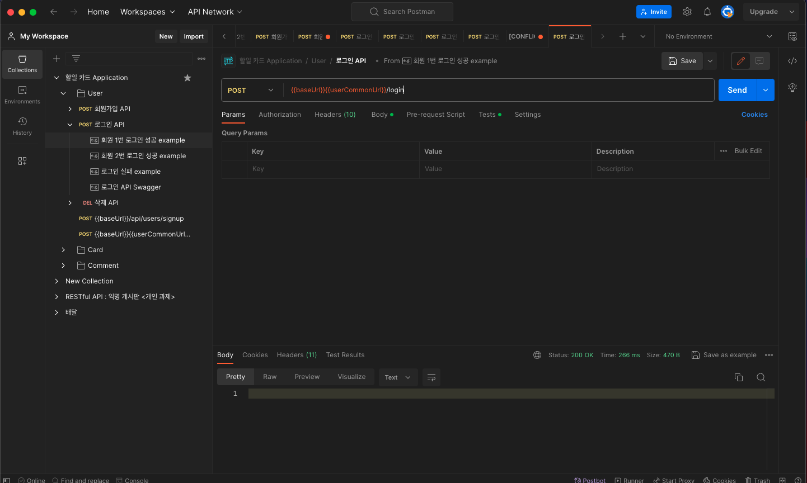
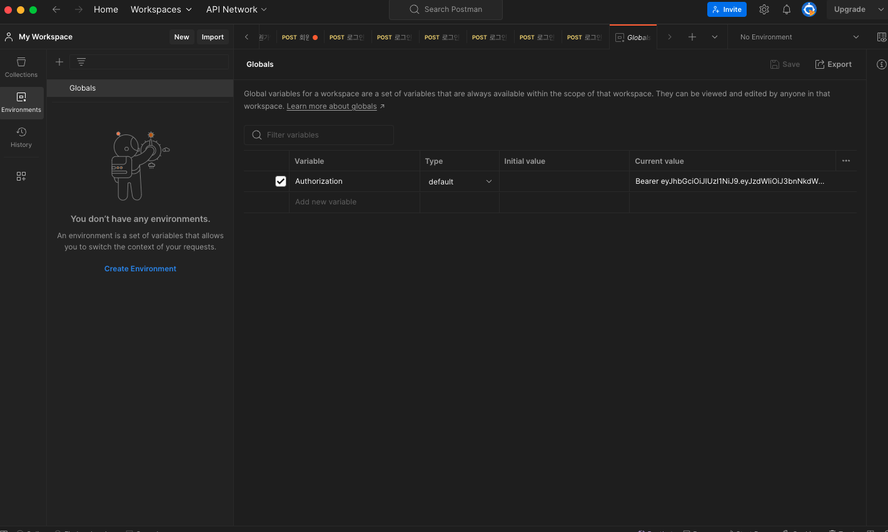

## 개요

> 프로젝트를 진행하면서 사용자가 로그인을 할 때마다 token을 발급을 해주었고, 이를 postman으로 테스트를 할 때 수동적으로 값을 넣어주었다.
> 이를 변수를 할당해주었음에도 불구하고 시간적인 비용이 발생하기 때문에 테스트 자동화를 도입하는 방법을 작성해볼 예정이다.

## 로그인 성공

회원가입을 한 사용자가 로그인을 성공하였을 때 http 상태코드 200과 응답 header에 **Authorization**이름으로 token이 발급되는 것을 확인할 수 있다.



나는 이를 local 변수를 설정해놓은 다음에 할당 받을때 마다 변수에 대입을 해주었다.



사실 이 부분에 대해서도 postman에서 테스트를 할 때마다 매번 넣어줘서 테스트 비용이 소모된다고 할 수 있다.

팀과제를 진행하면서 팀원 '종렬'님께서 해당 문제에 대해서 호기심을 가지고 구글링을 한 결과 postman에서 자동화 기능이 있는 것을 알려주셨다.

지금부터 어떻게 자동화를 하는지에 대해서 다뤄볼 예정이다.

가장 먼저 빨간 동그라미 부분에 Environments 탭에 들어와 Globals에 내가 사용하고 싶은 변수 이름을 설정해준다.

나는 token을 자동화하고 싶기에 Authorization 이라고 변수를 설정하였다.



그리고 두번째!



나는 로그인을 할 때 마다 자동화를 할 것이기에! 로그인 API 탭에 들어온 후 Tests 탭으로 들어가 해당 코드를 작성을 해준다.

```js
// postman에 응답 코드가 200이라면
// token이라는 변수에 응당 헤더의 이름이 Authorization으로 설정된 값을 대입
// 그 token값을 globals에 설정한 변수 Authorization으로 대입을 해준다!
if (pm.response.code === 200) {
  const token = pm.response.headers.get("Authorization");
  pm.globals.set("Authorization", token);
}
```

그 결과 global에 설정한 변수 Authorization에 비워있던 변수가!



로그인을 성공한 결과 !



해당 값이 잘 들어간 것을 확인 할 수 있다.


