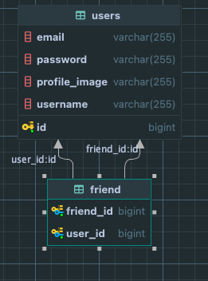
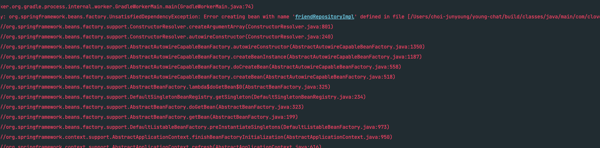

# 개요

> 지금 현재 최종 프로젝트를 진행하고 있다.

> 최종 프로젝트는 어떻게 하면 최상의 서비스를 줄 수 있는지를 중점으로 대용량 트래픽을 처리하고, 쿼리를 최적화함으로써 보다 편리한 서비스를 제공하는데에 있다.

> 현재 친구 목록에서 특정 단어로 친구의 이름을 검색하는 쿼리를 작성하고 있는데 이 로직을 어떻게 개선해나가는지에 대한 기록을 남기려고 한다.

## ERD

현재 서비스 코드를 작성 중이며, 사용자가 서로 친구를 맺을 수 있는 서비스이다.



## 친구 검색 서비스 로직

어떤 흐름으로 서비스가 구현되는지는 주석으로 처리를 하였다.

```java
@Transactional(readOnly = true)
    public List<FriendGetSearchListRes> getFriendSearchList(String keyword, User user) {
        // ----------------------------------------------
        // keyword 로 자신의 친구를 검색한다.
        // ex) 나: junxtar         친구: 홍길동, 이순신, 유관순, 손흥민
        // 검색창: 순
        // 결과: 이순신, 유관순
        // ----------------------------------------------

        long startTime = System.currentTimeMillis();

        // 1. 자신의 친구 목록을 꺼내온다.
        List<Friend> friends = findByUser(user);

        // 2. 자신의 친구 목록에서 친구의 id를 뽑아낸다.
        List<Long> friendsId = friends.stream()
            .map(friend -> friend.getFriend().getId())
            .toList();

        // 친구 id 목록으로 user 정보를 추출한 뒤 keyword가 포함되어 있는 친구를 dto로 변환
        List<FriendGetSearchListRes> collect = userRepository.findUsersByIdIn(friendsId)
            .orElseThrow(() -> new GlobalException(NOT_FOUND_USER))
            .stream()
            .filter(u -> u.getUsername().contains(keyword))
            .map(u -> FriendGetSearchListRes.to(u.getUsername(), u.getProfileImage()))
            .collect(Collectors.toList());

        long endTime = System.currentTimeMillis();
        log.info("실행 시간: " + ((endTime - startTime)));
        return collect;
    }
```

## 출력 결과

```java
2024-01-10T20:10:58.748+09:00  INFO 37134 --- [nio-8080-exec-3] c.c.y.d.friend.service.FriendService     : 실행 시간: 21
```

```java
2024-01-10T20:10:59.178+09:00  INFO 37134 --- [nio-8080-exec-3] c.c.y.d.friend.service.FriendService     : 실행 시간: 23
```

```java
Hibernate:
    select
        u1_0.id,
        u1_0.email,
        u1_0.password,
        u1_0.profile_image,
        u1_0.username
    from
        users u1_0
    where
        u1_0.email=?
Hibernate:
    select
        f1_0.friend_id,
        f1_0.user_id
    from
        friend f1_0
    where
        f1_0.user_id=?
Hibernate:
    select
        u1_0.id,
        u1_0.email,
        u1_0.password,
        u1_0.profile_image,
        u1_0.username
    from
        users u1_0
    where
        u1_0.id in (?,?,?,?)
```

## QueryDSL

QueryDSL에 대해서는 자세하게 설명되어 있는 참고 블로그 및 레퍼런스가 많기 때문에 설명에 대한 글은 생략하겠다.

<details>

<summary> Spring Boot 2.xx QueryDSL gradle 설정 </summary>

```java
plugins {
    ...
    id "com.ewerk.gradle.plugins.querydsl" version "1.0.10"
}

compileQuerydsl{
options.annotationProcessorPath = configurations.querydsl
}

configurations {
...
querydsl.extendsFrom compileClasspath
}

def querydslSrcDir = 'src/querydsl/generated'

querydsl {
library = "com.querydsl:querydsl-apt"
jpa = true
querydslSourcesDir = querydslSrcDir
}

sourceSets {
main {
java {
srcDirs = ['src/main/java', querydslSrcDir]
    }
}
}

project.afterEvaluate {
project.tasks.compileQuerydsl.options.compilerArgs = [
"-proc:only",
"-processor", project.querydsl.processors() +
',lombok.launch.AnnotationProcessorHider$AnnotationProcessor'
]
}

dependencies {
implementation("com.querydsl:querydsl-jpa") // querydsl
implementation("com.querydsl:querydsl-apt") // querydsl
}
```

</details>

<details>

<summary>Spring Boot 2.xx QueryDSL gradle 설정</summary>

```java
dependencies {
		....

    	// 9. QueryDSL 적용을 위한 의존성 (SpringBoot3.0 부터는 jakarta 사용해야함)
    implementation 'com.querydsl:querydsl-jpa:5.0.0:jakarta'
    annotationProcessor "com.querydsl:querydsl-apt:${dependencyManagement.importedProperties['querydsl.version']}:jakarta"
    annotationProcessor "jakarta.annotation:jakarta.annotation-api"
    annotationProcessor "jakarta.persistence:jakarta.persistence-api"

}
```

</details>

## QueryDsl 코드

정확한 성능 비교라고 하기에는 부족하다.

사실 QueryDsl 코드에서는 User를 반환하는 것이 아닌 해당 메서드에서 필요한 이름과, 프로필 이미지만을 가지고 있는 dto를 반환하기 때문이다.

```java
@Override
    public List<FriendGetSearchListRes> findFriendByKeyword(Long userId, String keyword) {
        QUser user = QUser.user;
        QFriend friend = QFriend.friend1;

        return queryFactory.select(
                Projections.constructor(FriendGetSearchListRes.class, user.username, user.profileImage))
            .from(user)
            .where(
                user.id.in(
                    JPAExpressions
                        .select(friend.friend.id)
                        .from(friend)
                        .where(friend.user.id.eq(userId))
                ),
                user.username.containsIgnoreCase(keyword)
            )
            .fetch();
    }
```

## 출력 결과

처음 실행 속도가 튀는 이유는 아직은 파악이 되지 않는다..

하지만 처음 이후로는 약 2배 가량 빠른 것을 확인할 수 있다.

이 부분이 정확히는 QueryDsl이 무조건 빠르다! 라고 장담을 할 수 없는 기록이다.

Query Dsl을 작성함으로써 비즈니스 로직도 개선 되었으며, User라는 객체를 반환하는 것이 아닌 내가 필요한 필드값만을 조회해왔기 때문이다.

```java
2024-01-10T22:42:36.605+09:00  INFO 49761 --- [nio-8080-exec-2] c.c.y.d.friend.service.FriendService     : 실행 시간: 218
```

```java
2024-01-10T22:42:38.259+09:00  INFO 49761 --- [nio-8080-exec-3] c.c.y.d.friend.service.FriendService     : 실행 시간: 6
```

```java
2024-01-10T22:50:44.639+09:00  INFO 49761 --- [nio-8080-exec-8] c.c.y.d.friend.service.FriendService     : 실행 시간: 5
```

```java
Hibernate:
    select
        u1_0.id,
        u1_0.email,
        u1_0.password,
        u1_0.profile_image,
        u1_0.username
    from
        users u1_0
    where
        u1_0.email=?
Hibernate:
    select
        u1_0.username,
        u1_0.profile_image
    from
        users u1_0
    where
        u1_0.id in(select
            f1_0.friend_id
        from
            friend f1_0
        where
            f1_0.user_id=?)
        and lower(u1_0.username) like ? escape '!'
```

## ++ Query Dsl로 반환할 응답 Dto 설정

이번 팀 프로젝트에서 Private 생성자 + @Builder를 활용하기로 컨벤션을 정하였다.

하지만 QueryDsl이 내부에 생성자를 직접 만들어주지 못해서 발생한 에러였다!

아래는 기존 Dto Class 이다 static method + @builder를 사용하여 해당 dto로 변환해주는 작업을 하였었다.

```java
@Getter
@NoArgsConstructor(access = AccessLevel.PROTECTED)
public class FriendGetSearchListRes {

    private String username;
    private String profileImage;

    @Builder
    private FriendGetSearchListRes(String username, String profileImage) {
        this.username = username;
        this.profileImage = profileImage;
    }

    public static FriendGetSearchListRes to(String username, String profileImage) {
        return FriendGetSearchListRes.builder()
            .username(username)
            .profileImage(profileImage)
            .build();
    }
}

```

### QueryDsl 반영 후

생성자를 private 접근제한자를 작성하지 못하기 때문에 다음 아래와 같이 작성을 헤주었다.

이렇게 작성해서 내가 의도한 바와 같이 정상적으로 작동을 하였다.

```java
@Getter
@AllArgsConstructor
@NoArgsConstructor(access = AccessLevel.PROTECTED)
public class FriendGetSearchListRes {

    private String username;
    private String profileImage;

}

```

## ++ Query Dsl로 인한 Test Code 영향

QueryDslConfig를 설정하면서 기존에 작성했던 Repository Test가 깨져버렸다.

에러 내용에도 `friendRepositoryImpl` 를 bean으로 생성하는 과정에서 발생한 오류라고 알려주고 있다.

관련된 내용을 찾아보니
@DataJpaTest의 어노테이션은 스프링이 관리하는 모든 빈을 가져오는 것이 아닌,

엔티티와 entityManager 정도만 등록해주기 때문에 JPAQueryFactory 빈은 인식하지 못하게 되는 것이라고 합니다.



### 해결방법

해결방법은 간단했다.

테스트 코드 클래스에 @Import(QueryDSLConfig.class) 어노테이션 추가로 해결 완료할 수 있다.

```java
@DataJpaTest
@ActiveProfiles("test")
@Import(QueryDslConfig.class)
@AutoConfigureTestDatabase(replace = AutoConfigureTestDatabase.Replace.NONE)
class UserRepositoryTest implements UserTest {

```
