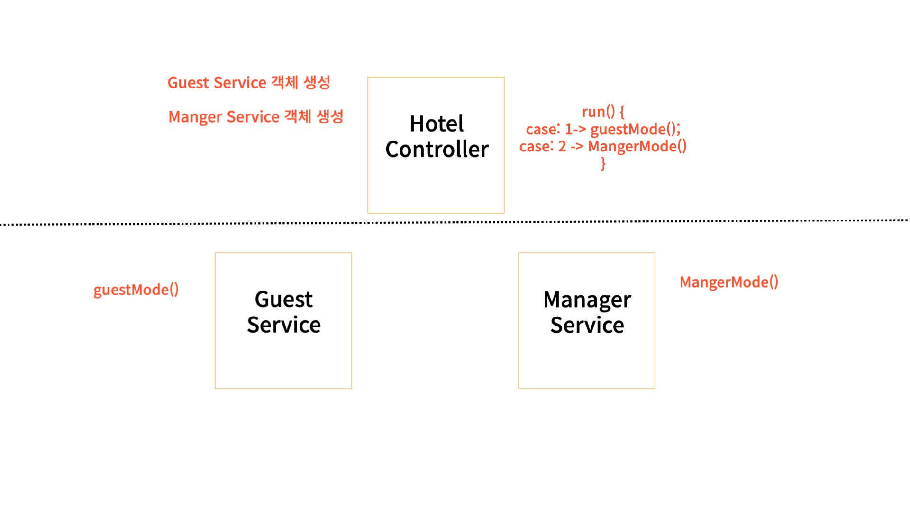
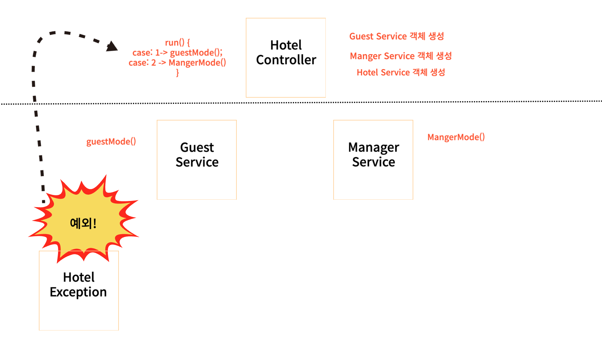

## 개요

> 팀 프로젝트로 자바를 활용한 호텔 프로그램을 만드는 과정 속에서 설계한 구조 속에서 클래스들의 순환을 참조하게 되는 문제를 겪었다.

## 프로젝트 구조

**프로젝트 구조를 간단하게라도 그림으로 설명해보겠습니다.**

아래와 같이 HotelController에서 run() 메서드를 실행하면 아래와 같이 출력이 된다.

```java
안녕하세요 JAVA 호텔입니다!
Mode를 선택해주세요
1. Guest
2. Manager
```



### 문제점

**GuestMode**로 들어왔다고 가정을 해보자. <br>
만약 다시 Mode 선택으로 돌아가고 싶다면 HotelController에 run()메서드를 사용을 해야할 것이다.

```java
public class GuestService

HotelController hotelController = new HotelController();

public void gusetMode() {
    //....
    if (...) {
        hotelController.run();
    }
}
```

첫번째 이미지에서 hotelController는 GuestService를 의존하고 있는 상태에서 <br>
GuestService에서도 hotelController를 의존하게 되는 순환참조를 해야하는 것이 구현을 하면서도 <br>
몸이 아니라고 반응을 하는 느낌을 받았다.

### 첫번재 방법

아래 그림 처럼 Mode를 선택하는 메서드로 돌아가고 싶은 순간 예외 클래스를 만들어 <br>
에러를 throw해서 HotelController에서 예외를 잡아서 다시 run() 메소드를 실행시키는 방법



> 이 방법은 사실 좋은 발상이라고는 생각하지만 사용자가 잘못된 입력을 한 것이 아닌데...
> 예외를 터트리는 것이 과연 올바른 접근 방법인 것일까? 라는 생각이 계속 맴돌았다.
> 하지만 이 방법을 사용한다면 GuestService 입장에서는 어떤 Controller가 자신을 의존하는 지 모르게 되어서
> 순환 참조 관계를 피할 수 있긴 했다.

### 두번째 방법

HotelCotroller에서 내부 로직으로 처리해주는 방식이었다.

```java
public class HotelController {
   GuestService guestService = new GuestService();
   ManagerService managerService = new ManagerService();

   public void run() {
      System.out.println("환영합니다. JAVA 호텔 입니다.");
      System.out.println("Mode 를 선택해주세요.");
      System.out.println("1. Guest Mode");
      System.out.println("2. Manager Mode");

      int command = sc.nextInt();
      switch (command) {
         case 1 -> {
            guestService.displayGuestMode();
            modeInputHandling();
         }
         case 2 -> {
            managerService.displayManagerMode();
            modeInputHandling();
         }
      }
   }
}
```

아래와 같이 **Service** 로직을 반복문을 설정해서 자연스럽게 내가 모드로 돌아가고 싶은 입력을 하였을 때 <br>
break문을 활용해 메서드를 강제 종료해 HelloController에 run을 다시 실행시켜주게끔 구성하였다.

```java
public class GuestService {
  public void displayGuestMode() {
      while (true) {
         System.out.println("1. 이미 가입한 회원입니다.");
         System.out.println("2. 처음 방문한 회원입니다.");
         int command = sc.nextInt();
         if (command == 0) {
            break;
         } else if (command == 1) {
            signIn();
         } else if (command == 2) {
            signUp();
         } else {
            errorMessage();
         }
      }
   }
}
```

## 느낀점

두번째 방법이 구조와 문맥상 적합한 방법이라고 생각해 두번째 방법을 사용하여 구현하였다.

단순히 구조만을 생각해서 이 방법을 생각해주지 못했던 것이다.

하나의 해결법을 찾았다고 내 자신의 시야가 좁아졌었다.

이러한 습관을 고치는 연습을 해야겠다고 느꼈다.
