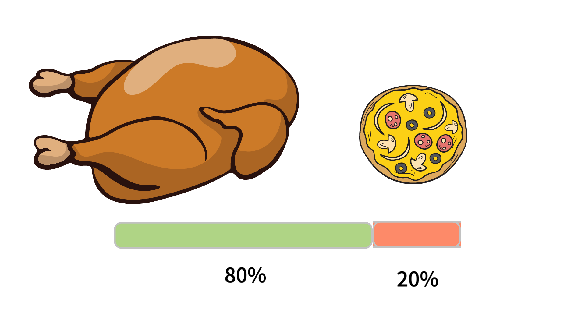

# 개요

같은 타입의 Bean이 여러개가 존재한다면 이를 유연하게 처리하는 방법을 코드로 정리해보는 시간을 가져보겠다.

## Food - Interface

```java

public interface Food {
    void eat();
}
```

## Chicken - Food 구현체

```java
@Component
public class Chicken implements Food {
    @Override
    public void eat() {
        System.out.println("치킨을 먹습니다.");
    }
}
```

## Pizza - Food 구현체

```java
@Component
public class Pizza implements Food {
    @Override
    public void eat() {
        System.out.println("피자를 먹습니다.");
    }
}
```

위 코드에서 구현체 클래스에 @Component 어노테이션을 설정함으로써 food타입의 Bean이 두개가 등록되었다.


**아래 그림**과 같이 테스트 환경에서 사용하려고 하면 Idea에서 이렇게 말해주고 있다.

> "너 지금 food Bean 2개 이상 있어 무엇을 사용할지 명시해줘"


## 총 3가지의 방법이 존재한다.

### 첫번째. 변수명으로 명시

```java
@SpringBootTest
public class BeanTest {

    @Autowired
    Food pizza;  // 이처럼 변수명으로 어떤 Bean을 쓸지 명시

    @Test
    void test1() {
        pizza.eat();
    }
}

```

### 두번째. @Primary

Pizza 구현체에 @Primary 어노테이션을 설정 함으로써 우선순위 부여

```java
@Component
@Primary
public class Pizza implements Food {
    @Override
    public void eat() {
        System.out.println("피자를 먹습니다.");
    }
}

---------------------------------------------------------

@SpringBootTest
public class BeanTest {

    @Autowired
    Food food;

    @Test
    void test1() {
        food.eat();
    }
}
```

### 세번째, @Qualifier

사용한 Bean의 이름을 @Qualifier 어노테이션에 명시해주기

```java
@SpringBootTest
public class BeanTest {

    @Autowired
    @Qualifier("chicken")
    Food food;

    @Test
    void test1() {
        food.eat();
    }
}
```

그렇다면 현재 Pizza 클래스에는 `@Primary` 가 달려있고,

우리가 사용하는 food 변수에는 ` @Qualifier` 로 달려있다면 어떤 것이 출력 될까?

```java
출력 결과 : 치킨을 먹습니다.
```

이 코드에서 우리는 @Qualifier가 우선순위가 높은것을 확인할 수 있습니다.

이 둘을 혼용해서 우리는 더 유연하게 코드를 작성할 수 있습니다.

예를 들어 치킨과 피자 두개를 파는 음식점이라고 가정을 해보겠습니다!



## 결론

위 그림과 같이 치킨의 점유율이 높은 음식점이라면 chicken 구현체에 @Primary를 설정을 하고

pizza의 객체가 필요한 시점에는 @Qualifier를 설정한다면 코드를 보다 단순하고 유지보수에 용이할 수 있다는 것을 알 수 있다.
