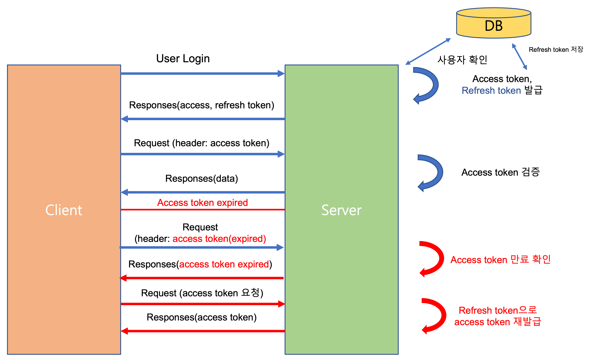

# 개요

> 이번 프로젝트에 RefreshToken을 적용을 했는데 이에 대해서 더 자세하게 개념을 보완하고 이해하기 위해 작성을 해보려고한다.

## Token이란?

클라이언트에서 인증 정보를 보관하는 방법이다.

보관하는 방법은 다양한데 크게 LocalStorage, Cookie에 보관하는 방법이 있다.

토큰 기반 인증은 기존에 세션 기반의 인증 방법을 보완한 방식이라고 생각할 수 있다.

기존에 세션 기반 인증 같은 경우는 유저 정보를 요청 할 때 마다 해당 정보 제공 여부는 세션 값의

일치여부에 기반을 했다. 이러한 정보 요청마다 DB를 살펴보는 것이 부담이 되었기 때문에 토큰 기반 인증 방식이 도입되었다.

 

## JWT란?

Json Web Token 의 약자로 Web에서 사용되는 json 형태의 토큰이다.

종류로는 AccessToken과 RefreshToken이 있다.

 

## AccessToken & RefreshToken

AccessToken은 보호된 정보들에 접근할 수 있는 권한에 사용되는 Token이다.

RefreshToken은 이 AccessToken에 재발급 여부에 사용되는 일종의 재발급 키라고 생각할 수 있다.

즉, 사용자는 로그인을 할 때 AccessToken과 RefreshToken을 발급 받는다.

사용자가 예를 들어 게시물을 작성한다고 가정할 때 게시물 작성 API는 AccessToken을 가지고 있어야 API를 사용할 수 있는 셈이다.

보통은 AccessToken은 짧게는 5분에서 30분의 유효시간을 할당하고, RefreshToken 같은경우는 2주 가량의 시간을 부여한다.

AccessToken는 RefreshToken에 비해서 시간을 비교적 짧게 할당한다.

그 이유는 AccessToken으로 유저의 정보를 탈취 당할 우려가 있기 때문입니다.

우리가 AccessToken에 할당한 시간안에 탈취를 당한다면 보안상 위험한 것은 마찬가지이지만,

시간을 짧게 설정하여 그보다는 더 보안적인 환경을 구축할 수 있습니다.

그리고 AccessToken의 시간이 만료가되어도 RefreshToken을 가지고 있다면 이를 재발급 받는 형식으로 통신을 할 수 있습니다.

해당 아래 **그림**을 살펴보면 서버와 클라이언트가 어떻게 RefreshToken과 AccessToken을 사용해 접근하는 한눈에 알아볼 수 있다.

[그림출처](https://nowgnas.github.io/posts/refreshtoken/)
